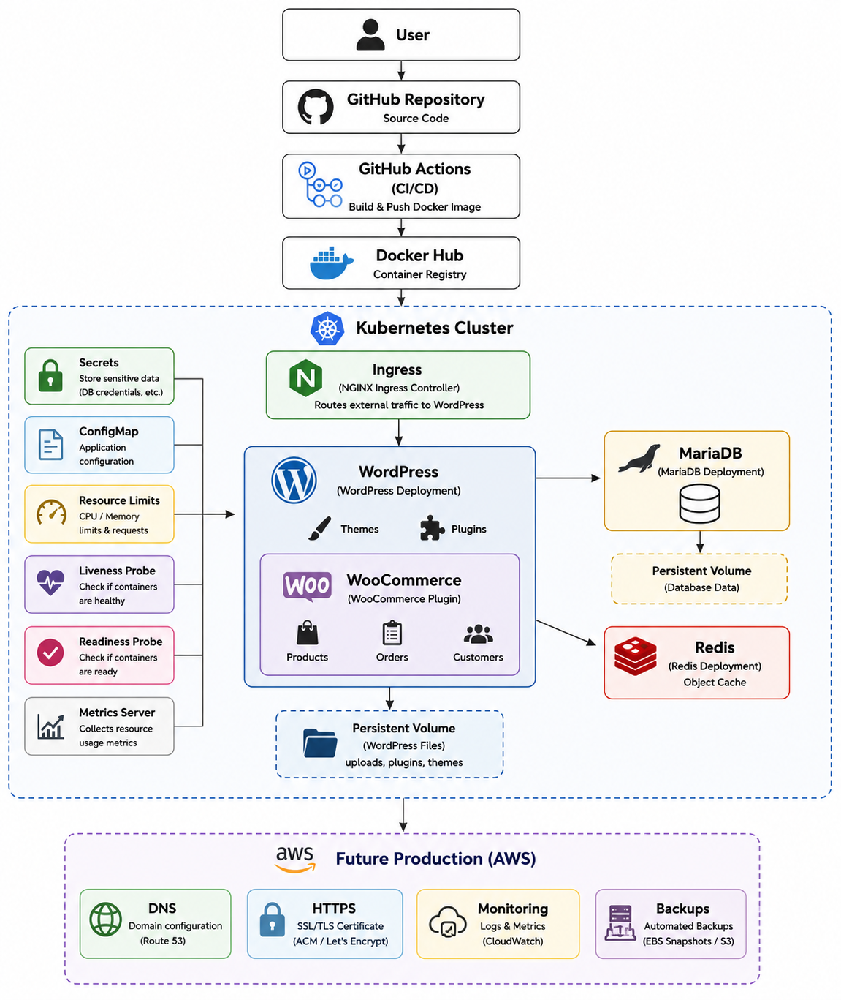
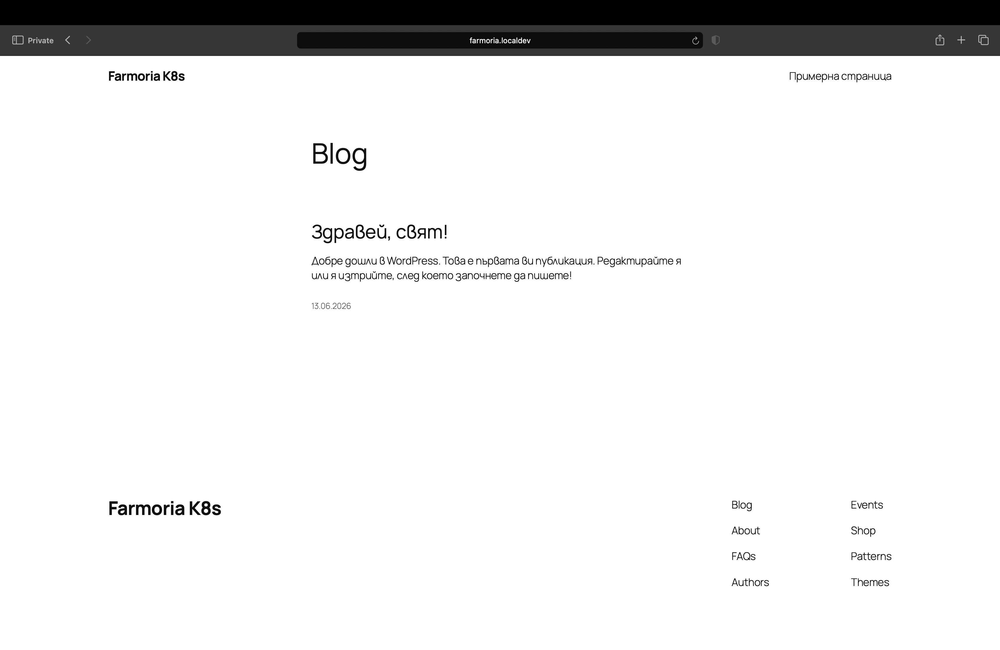
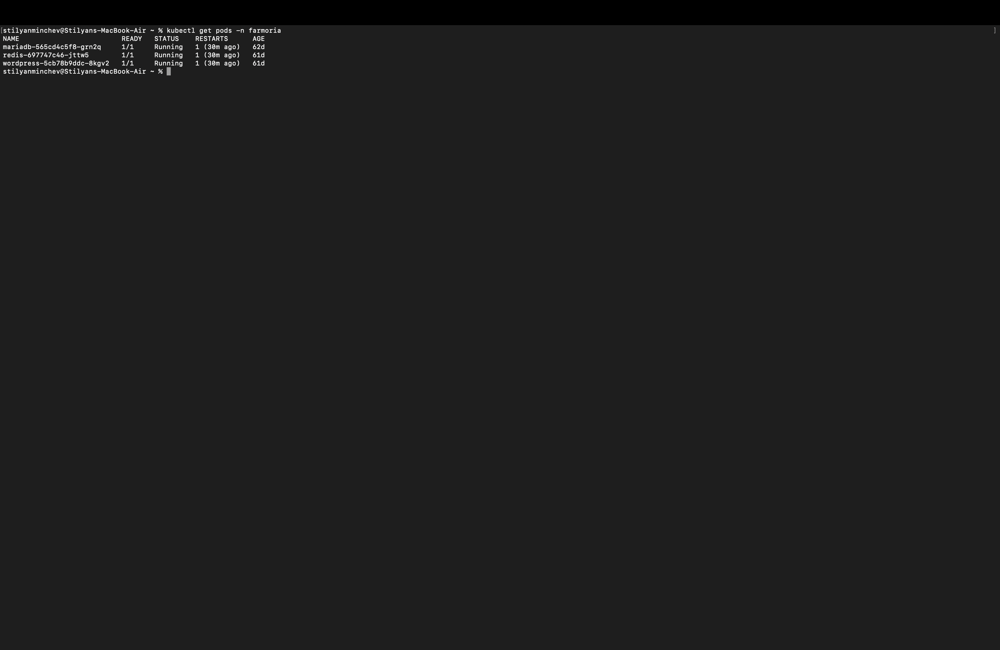
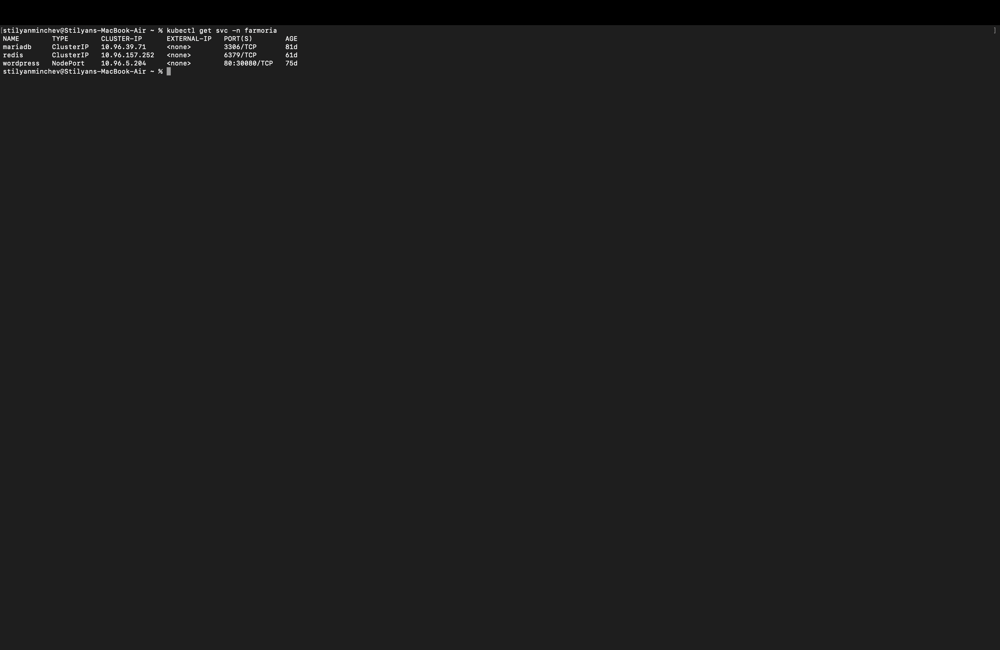
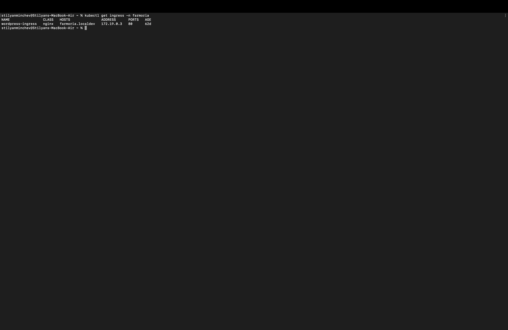
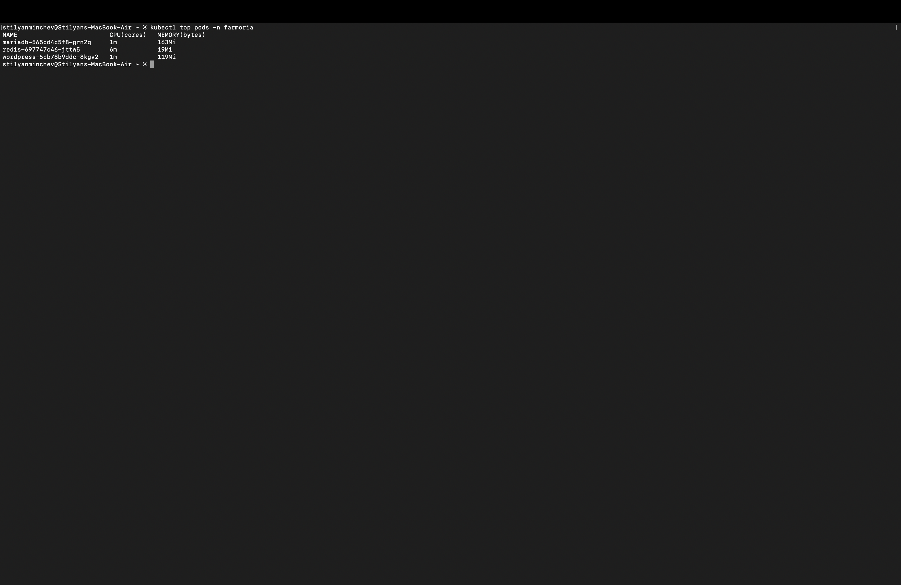
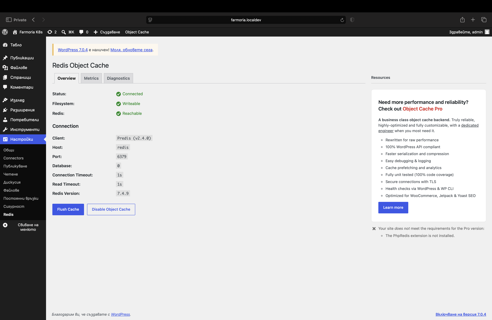
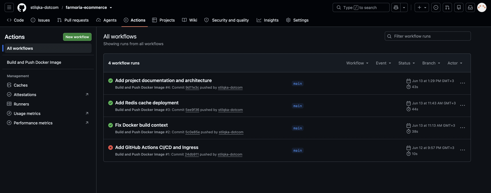

# Farmoria Ecommerce

A cloud-native WordPress/WooCommerce ecommerce project demonstrating modern containerization, Kubernetes orchestration and CI/CD practices.

---

# Project Overview

Farmoria Ecommerce is a WordPress/WooCommerce ecommerce application developed to demonstrate both a functional online store and a modern cloud-native deployment architecture.

The project combines Docker containerization, Kubernetes orchestration and GitHub Actions Continuous Integration to create a production-oriented development workflow. The application consists of WordPress, WooCommerce, MariaDB and Redis, all running inside a Kubernetes cluster.

The current deployment targets a local Kubernetes environment used for development and testing. Production deployment to AWS is planned as the next stage of the project.

---

# Features

- WordPress content management
- WooCommerce ecommerce platform
- Docker containerization
- Kubernetes deployment
- MariaDB relational database
- Redis object cache
- NGINX Ingress routing
- Persistent database storage
- Kubernetes resource management
- Liveness and Readiness probes
- GitHub Actions CI pipeline
- Docker Hub image publishing
- Kubernetes Metrics Server monitoring

---

# Tech Stack

## Application

- WordPress
- WooCommerce

## Database & Cache

- MariaDB
- Redis

## Containers

- Docker
- Docker Hub

## Orchestration

- Kubernetes
- NGINX Ingress Controller

## CI/CD

- GitHub
- GitHub Actions

## Monitoring

- Kubernetes Metrics Server

## Documentation

- Markdown
- diagrams.net

---

# Architecture



The application follows a cloud-native architecture.

Source code is stored in GitHub. Every push to the **main** branch triggers a GitHub Actions workflow that builds the custom WordPress Docker image and publishes it to Docker Hub.

The Kubernetes cluster runs the WordPress application together with MariaDB and Redis. NGINX Ingress handles HTTP routing while Kubernetes Services provide internal communication between the application components. MariaDB stores its data on a Persistent Volume Claim to preserve the database across pod restarts.

The current Kubernetes cluster is intended for local development and testing and is not yet used as a public production environment.

---

# Repository Structure

```text
farmoria-ecommerce/
├── .github/
│   └── workflows/
│       └── docker-build-push.yml
├── docker/
│   ├── Dockerfile
│   └── docker-compose.yml
├── docs/
├── k8s/
│   ├── namespace.yaml
│   ├── secrets.yaml
│   ├── pvc.yaml
│   ├── mariadb-deployment.yaml
│   ├── mariadb-service.yaml
│   ├── redis-deployment.yaml
│   ├── redis-service.yaml
│   ├── wordpress-deployment.yaml
│   ├── wordpress-service.yaml
│   └── wordpress-ingress.yaml
├── screenshots/
├── security/
├── .gitignore
└── README.md
```

## Repository Overview

| Directory | Purpose |
|----------|---------|
| `.github/workflows` | GitHub Actions CI workflow |
| `docker` | Docker image and Docker Compose configuration |
| `docs` | Technical documentation |
| `k8s` | Kubernetes manifests |
| `screenshots` | Project screenshots |
| `security` | Security documentation |
| `README.md` | Main project documentation |

---

# Local Deployment

## Prerequisites

Before running the project locally make sure the following software is installed:

- Git
- Docker Desktop
- Docker Compose

Verify the installation:

```bash
git --version
docker --version
docker compose version
```

## Clone Repository

```bash
git clone https://github.com/stilqka-dotcom/farmoria-ecommerce.git
cd farmoria-ecommerce
```

## Environment Configuration

Create a local `.env` file inside the **docker** directory.

Example variables:

```text
MYSQL_DATABASE=<database>
MYSQL_USER=<username>
MYSQL_PASSWORD=<password>
MYSQL_ROOT_PASSWORD=<root-password>
WORDPRESS_PORT=8080
```

The `.env` file is intentionally excluded from version control and must be created locally before starting the application.

## Start Docker Environment

```bash
cd docker
docker compose up -d
```

Docker Compose starts:

- MariaDB
- WordPress

Persistent Docker volumes are automatically created for both services.

## Verify Containers

```bash
docker ps
```

Verify that both containers are running successfully before continuing.
---

# Kubernetes Deployment

## Prerequisites

Before deploying the application to Kubernetes, ensure the following components are available:

- Kubernetes Cluster
- kubectl
- NGINX Ingress Controller
- Kubernetes Metrics Server

Verify cluster connectivity:

```bash
kubectl cluster-info
kubectl get nodes
```

## Deploy Namespace

```bash
kubectl apply -f k8s/namespace.yaml
```

## Deploy Secrets

```bash
kubectl apply -f k8s/secrets.yaml
```

## Deploy Persistent Storage

```bash
kubectl apply -f k8s/pvc.yaml
```

## Deploy MariaDB

```bash
kubectl apply -f k8s/mariadb-deployment.yaml
kubectl apply -f k8s/mariadb-service.yaml
```

## Deploy Redis

```bash
kubectl apply -f k8s/redis-deployment.yaml
kubectl apply -f k8s/redis-service.yaml
```

## Deploy WordPress

```bash
kubectl apply -f k8s/wordpress-deployment.yaml
kubectl apply -f k8s/wordpress-service.yaml
```

## Deploy Ingress

```bash
kubectl apply -f k8s/wordpress-ingress.yaml
```

## Validate Deployment

```bash
kubectl get pods -n farmoria
kubectl get svc -n farmoria
kubectl get ingress -n farmoria
kubectl get pvc -n farmoria
```

Expected running components:

- WordPress
- MariaDB
- Redis
- Kubernetes Ingress
- MariaDB Persistent Volume Claim

## Local Access

Forward the NGINX Ingress Controller:

```bash
kubectl port-forward -n ingress-nginx svc/ingress-nginx-controller 8082:80
```

Open the application:

```text
http://farmoria.localdev:8082
```

WordPress administration:

```text
http://farmoria.localdev:8082/wp-admin
```

> **Note**
>
> The hostname `farmoria.localdev` must exist in the local `/etc/hosts` file.

---

# CI/CD Pipeline

The project uses GitHub Actions as its Continuous Integration platform.

Every push to the **main** branch automatically starts the pipeline.

Pipeline workflow:

```text
Developer
        │
        ▼
Push to main
        │
        ▼
GitHub Actions
        │
        ▼
Repository Checkout
        │
        ▼
Docker Hub Authentication
        │
        ▼
Build Docker Image
        │
        ▼
Push Docker Image
        │
        ▼
stilyan03/farmoria-wordpress:latest
```

The current pipeline automatically:

- Checks out the repository
- Authenticates with Docker Hub
- Builds the custom WordPress Docker image
- Pushes the image to Docker Hub

Kubernetes deployment is currently performed manually after the image has been published.

---

# Monitoring

Basic infrastructure monitoring is provided by the Kubernetes Metrics Server.

Useful commands:

```bash
kubectl top nodes
kubectl top pods -n farmoria
```

The Metrics Server provides CPU and memory utilization for Kubernetes nodes and application pods.

---

# Screenshots

## Homepage



---

## Kubernetes Pods



---

## Kubernetes Services



---

## Kubernetes Ingress



---

## Kubernetes Resource Usage



---

## Redis Object Cache



---

## GitHub Actions



---

# Documentation

Additional technical documentation is available in the `docs` directory.

- Architecture → `docs/architecture.md`
- Deployment Guide → `docs/deployment-guide.md`
- Backup & Restore Guide → `docs/backup-restore-guide.md`
- Troubleshooting Guide → `docs/troubleshooting-guide.md`

---

# Project Status

## Completed

- Dockerized WordPress environment
- Docker Compose deployment
- Kubernetes deployment
- MariaDB integration
- Redis object cache
- NGINX Ingress routing
- Persistent database storage
- Kubernetes Services
- Resource requests and limits
- Liveness and Readiness probes
- GitHub Actions CI pipeline
- Docker Hub integration
- Kubernetes Metrics Server
- Technical documentation

## In Progress

- Product Management documentation
- Ecommerce content
- Product catalog
- Store optimization

## Planned

- Production WordPress migration
- AWS deployment
- Public DNS
- HTTPS/TLS certificates
- Automated backup strategy
- Production monitoring
- Production rollout

---

# Future Work

Planned improvements include:

- Production deployment on AWS
- Automated Kubernetes deployment
- HTTPS/TLS configuration
- Public domain configuration
- Automated backup strategy
- Enhanced monitoring and alerting
- SEO optimization
- Expanded product catalog
- Additional WooCommerce features
- Production-ready ecommerce environment

---

# License

This project was created for educational purposes to demonstrate modern DevOps, Kubernetes and cloud-native deployment practices using WordPress and WooCommerce.